```mermaid
%%{init: {'flowchart': {'nodeSpacing': 170, 'rankSpacing': 70}}}%%
graph TD
    classDef program fill:#fff,stroke:#000,stroke-width:1px,align:left,font-family:'Times New Roman',serif,font-size:20px,white-space:nowrap;
    classDef root fill:#f0f0f0,stroke:#000,stroke-width:1px,font-family:'Times New Roman',serif,font-size:25px;
    classDef best fill:#e6fffa,stroke:#2c7a7b,stroke-width:2px,font-family:'Times New Roman',serif,font-size:25px;

    N0[("Empty Program")]:::root

    %% ---------------------------------------------------------
    %% Level 1: Inner Loop (Survival)
    %% ---------------------------------------------------------
    
    N1_1["$$u_{tx} = -K_w \cdot \mathbf{\tanh(\omega_x)} \rule[0px]{0pt}{10px}$$"]:::program
    N1_2["$$u_{tx} = \mathbf{-K_w \cdot \omega_x} \rule[0px]{0pt}{10px}$$<br/>"]:::best
    %% 修改点1：sign 改为 sgn
    N1_3["$$u_{tx} = -K_w \cdot \mathbf{\mathrm{sgn}(\omega_x)} \rule[0px]{0pt}{10px}$$"]:::program

    %% ---------------------------------------------------------
    %% Level 2: Mid Loop (Velocity)
    %% ---------------------------------------------------------
    
    N1_2_1["$$u_{tx} = \dots + K_d \cdot v_y \cdot \mathbf{|v_y|} \rule[0px]{0pt}{10px}$$<br/>(Lateral Drag)"]:::program
    N1_2_2["$$u_{tx} = -K_w \cdot \omega_x + \mathbf{K_d \cdot v_y} \rule[0px]{0pt}{10px}$$<br/>(Lateral Damping)"]:::best
    %% 修改点2：diff(e_y) 改为 \dot{e}_y (导数符号)
    N1_2_3["$$u_{tx} = \dots + K_d \cdot \mathbf{\dot{e}_y} \rule[0px]{0pt}{10px}$$<br/>(D-Term)"]:::program

    %% ---------------------------------------------------------
    %% Level 3: Outer Loop (Position)
    %% ---------------------------------------------------------
    
    N1_2_2_1["$$u_{tx} = \dots - K_p \cdot \mathbf{e_y} \rule[0px]{0pt}{10px}$$<br/>(Lateral P)"]:::program
    N1_2_2_2["$$u_{tx} = -K_w \cdot \omega_x + K_d \cdot v_y - \mathbf{K_p \cdot \tanh(e_y)}   \rule[-7px]{0pt}{10px} \rule[0.1px]{0pt}{0.1px}$$<br/>(Lateral Saturation)"]:::best
    N1_2_2_3["$$u_{tx} = \dots - K_i \cdot \mathbf{\int e_y} \rule[0px]{0pt}{10px}$$<br/>(Lateral I)"]:::program
    N1_2_2_4["$$u_{tx} = \dots - K_p \cdot \mathbf{\mathrm{sgn}(e_y)(|e_y|-\epsilon)^+} \rule[0px]{0pt}{10px}$$<br/>(Lateral Deadzone)"]:::program

    %% Connections
    N0 -.-> N1_1
    N0 -- "Add Damping" --> N1_2
    N0 -.-> N1_3
    
    N1_2 -.-> N1_2_1
    N1_2 -- "Add Velocity" --> N1_2_2
    N1_2 -.-> N1_2_3
    
    N1_2_2 -.-> N1_2_2_1
    N1_2_2 -- "Add Position" --> N1_2_2_2
    N1_2_2 -.-> N1_2_2_3
    N1_2_2 -.-> N1_2_2_4
```

# Control Program Evolution Tree

This tree illustrates the evolutionary path of the control logic, from basic survival to advanced tracking.

## 🌱 Level 1: Inner Loop (Survival / Rate Stabilization)
*   **Main Path**: `u = -Kw * ang_vel` (Linear Damping)  
    *   *Status*: ✅ Stable (Cost: 96.0100)
    *   *Description*: Prevents flipping by resisting rotation.
*   **Branch 1.1 (Nonlinear)**: `u = -Kw * smooth(ang_vel)`
    *   *Idea*: Soft damping for small rotations, saturated for large ones.
*   **Branch 1.2 (Bang-Bang)**: `u = -Kw * sign(ang_vel)`
    *   *Idea*: Maximum force against any rotation. Often causes chatter.
*   **Branch 1.3 (Integral)**: `u = -Kw * ang_vel - Ki_rate * int(ang_vel)`
    *   *Idea*: Eliminates steady-state rotation drift.

## 🌿 Level 2: Mid Loop (Velocity Stabilization)
*   **Main Path**: `u = (Level 1) + Kd * vel` (Linear Velocity Feedback)
    *   *Status*: ✅ Stable Hover (Cost: 96.0100)
    *   *Description*: Acts as an "electronic brake" to stop drifting.
*   **Branch 2.1 (Quadratic)**: `u = (Level 1) + Kd * vel * abs(vel)`
    *   *Idea*: Simulates physical air drag ($F \propto v^2$).
*   **Branch 2.2 (Error Derivative)**: `u = (Level 1) + Kd * diff(pos_err)`
    *   *Idea*: Reacts to the rate of change of error rather than absolute velocity.

## 🌳 Level 3: Outer Loop (Position Tracking)
*   **Main Path**: `u = (Level 2) - Kp * smooth(pos_err)` (Nonlinear P-Control)
    *   *Status*: 🏆 Perfect Tracking (Cost: 80.1749)
    *   *Description*: "Stiff" near target, "Safe" far away.
*   **Branch 3.1 (Linear)**: `u = (Level 2) - Kp * pos_err`
    *   *Idea*: Standard Linear P. Risk of saturation/flip at long distance.
*   **Branch 3.2 (PID)**: `u = (Level 2) - Kp * smooth(pos_err) - Ki * int(pos_err)`
    *   *Idea*: Adds Integral term to fix steady-state error (e.g., wind).
*   **Branch 3.3 (Feedforward)**: `u = (Level 2) - Kp * smooth(pos_err) + K_ff * target_vel`
    *   *Idea*: Anticipates target movement (good for fast trajectories).
*   **Branch 3.4 (Gain Scheduling)**: `u = (Level 2) - Kp * pos_err / (1 + abs(pos_err))`
    *   *Idea*: Explicitly reduces gain as error increases.

---
**Best Parameters (Main Path Level 3):**
- `k_p = 0.489`
- `k_s = 1.285`
- `k_d = 1.062`
- `k_w = 0.731`

## 📊 Visualization (Mermaid)

